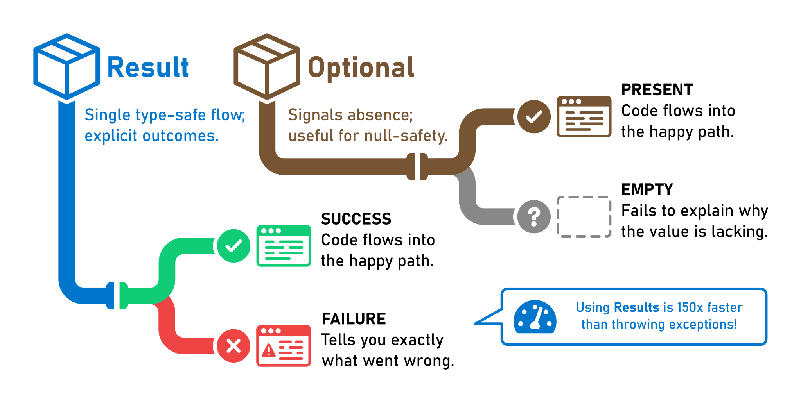

# Introduction

<picture><source srcset=".gitbook/assets/result-logo.dark.svg" media="(prefers-color-scheme: dark)"></picture>


## Handle success and failure in Java without exceptions

Wave goodbye to slow exceptions and embrace clean, efficient error handling by encapsulating operations that may succeed
or fail in a type-safe way.

<div data-full-width="true">
<picture><source srcset=".gitbook/assets/mental-model.dark.svg" media="(prefers-color-scheme: dark)"></picture>
</div>




`Result` objects represent the outcome of an operation, removing the need to check for null. Operations that succeed
produce results encapsulating a *success* value; operations that fail produce results with a *failure* value. Success
and failure can be represented by whatever types make the most sense for each operation.




### Latest Releases

Available in [](https://central.sonatype.com/artifact/com.leakyabstractions/result/)

<table data-card-size="large" data-view="cards" data-full-width="false">
<thead>
<tr>
<th align="center"></th>
<th align="center"></th>
<th data-hidden data-card-target data-type="content-ref"></th>
</tr>
</thead>
<tbody>
<tr>
<td align="center"><strong>Works with</strong></td>
<td align="center"><picture><source srcset=".gitbook/assets/logo-maven.dark.svg" media="(prefers-color-scheme: dark)"></picture></td>
<td><a href="docs/start/adding-dependency.md#maven">Maven</a></td>
</tr>
<tr>
<td align="center"><strong>Works with</strong></td>
<td align="center"><picture><source srcset=".gitbook/assets/logo-gradle.dark.svg" media="(prefers-color-scheme: dark)"></picture></td>
<td><a href="docs/start/adding-dependency.md#gradle">Gradle</a></td>
</tr>
</tbody>
</table>



```xml
<dependencies>
    <dependency>
        <groupId>com.leakyabstractions</groupId>
        <artifactId>result</artifactId>
        <version>1.0.0.0</version>
    </dependency>
</dependencies>
```



```groovy
dependencies {
    implementation("com.leakyabstractions:result:1.0.0.0")
}
```




### Add-Ons

Integrate Result with popular libraries.

<table data-card-size="large" data-view="cards">
<thead>
<tr>
<th align="center"></th>
<th align="center"></th>
<th data-hidden data-card-target data-type="content-ref"></th>
</tr>
</thead>
<tbody>
<tr>
<td align="center"><strong>Assert results fluently with</strong></td>
<td align="center"><picture><source srcset=".gitbook/assets/logo-assertj.dark.svg" media="(prefers-color-scheme: dark)"></picture></td>
<td><a href="add-ons/assertj.md">AssertJ</a></td>
</tr>
<tr>
<td align="center"><strong>Serialize results to JSON with</strong></td>
<td align="center"><picture><source srcset=".gitbook/assets/logo-jackson.dark.svg" media="(prefers-color-scheme: dark)"></picture></td>
<td><a href="add-ons/jackson.md">Jackson</a></td>
</tr>
</tbody>
</table>


### Demo Projects

Try Result in 5 minutes.

<table data-card-size="large" data-view="cards">
<thead>
<tr>
<th align="center"></th>
<th align="center"></th>
<th data-hidden data-card-target data-type="content-ref"></th>
</tr>
</thead>
<tbody>
<tr>
<td align="center"><strong>Works with</strong></td>
<td align="center"></td>
<td><a href="extra/demo/spring-boot.md">Spring Boot Demo</a></td>
</tr>
<tr>
<td align="center"><strong>Works with</strong></td>
<td align="center"><picture><source srcset=".gitbook/assets/logo-micronaut.dark.svg" media="(prefers-color-scheme: dark)"></picture></td>
<td><a href="extra/demo/micronaut.md">Micronaut Demo</a></td>
</tr>
</tbody>
</table>


### Why Results?

<table data-view="cards">
<thead>
<tr>
<th align="center" width="64"></th>
<th align="center"></th>
<th align="center"></th>
<th data-hidden data-card-target data-type="content-ref"></th>
</tr>
</thead>
<tbody>
<tr>
<td align="center"><picture><source srcset=".gitbook/assets/tachometer-alt.dark.svg" media="(prefers-color-scheme: dark)"></picture></td>
<td align="center"><strong>Boost Performance</strong></td>
<td align="center">Avoid exception overhead and benefit from faster operations</td>
<td><a href="extra/benchmarks.md">Benchmarks</a></td>
</tr>
<tr>
<td align="center"><picture><source srcset=".gitbook/assets/tint.dark.svg" media="(prefers-color-scheme: dark)"></picture></td>
<td align="center"><strong>Simple API</strong></td>
<td align="center">Leverage a familiar interface for a smooth learning curve</td>
<td><a href="docs/start/">Getting Started</a></td>
</tr>
<tr>
<td align="center"><picture><source srcset=".gitbook/assets/bolt.dark.svg" media="(prefers-color-scheme: dark)"></picture></td>
<td align="center"><strong>Streamlined Error Handling</strong></td>
<td align="center">Handle failure explicitly to simplify error propagation</td>
<td><a href="docs/advanced/screening.md">Screening Results</a></td>
</tr>
<tr>
<td align="center"><picture><source srcset=".gitbook/assets/shield-alt.dark.svg" media="(prefers-color-scheme: dark)"></picture></td>
<td align="center"><strong>Safe Execution</strong></td>
<td align="center">Ensure safer and more predictable operation outcomes</td>
<td><a href="docs/basic/checking.md">Checking Success or Failure</a></td>
</tr>
<tr>
<td align="center"><picture><source srcset=".gitbook/assets/glasses.dark.svg" media="(prefers-color-scheme: dark)"></picture></td>
<td align="center"><strong>Enhanced Readability</strong></td>
<td align="center">Reduce complexity to make your code easier to understand</td>
<td><a href="docs/basic/conditional.md">Conditional Actions</a></td>
</tr>
<tr>
<td align="center"><picture><source srcset=".gitbook/assets/filter.dark.svg" media="(prefers-color-scheme: dark)"></picture></td>
<td align="center"><strong>Functional Style</strong></td>
<td align="center">Embrace elegant, functional programming paradigms</td>
<td><a href="docs/advanced/transforming.md">Transforming Results</a></td>
</tr>
<tr>
<td align="center"><picture><source srcset=".gitbook/assets/feather-alt.dark.svg" media="(prefers-color-scheme: dark)"></picture></td>
<td align="center"><strong>Lightweight</strong></td>
<td align="center">Keep your project slim with no extra dependencies</td>
<td><a href="docs/start/adding-dependency.md">Adding Result to Your Build</a></td>
</tr>
<tr>
<td align="center"><picture><source srcset=".gitbook/assets/balance-scale.dark.svg" media="(prefers-color-scheme: dark)"></picture></td>
<td align="center"><strong>Open Source</strong></td>
<td align="center">Enjoy transparent, permissive Apache 2 licensing</td>
<td><a href="extra/license.md">License</a></td>
</tr>
<tr>
<td align="center"><picture><source srcset=".gitbook/assets/mug-hot.dark.svg" media="(prefers-color-scheme: dark)"></picture></td>
<td align="center"><strong>Pure Java</strong></td>
<td align="center">Seamless compatibility from JDK8 to the latest versions</td>
<td><a href="https://github.com/LeakyAbstractions/result/">Source code</a></td>
</tr>
</tbody>
</table>


### Ready to Tap into the Power of Results?

Read the guide and transform your error handling today.


[start](docs/start/)



[basic](docs/basic/)



[advanced](docs/advanced/)


Also available as an **ebook** in multiple formats. [Download your free copy now!](https://leanpub.com/result/)


### TL;DR

Not a fan of reading long docs? No worries! Tune in to *Deep Dive*, a podcast generated by [NetbookLM](https://notebooklm.google.com/).
In just a few minutes, you'll get the essential details and a fun intro to what this library can do for you!


